# 📘 Проект "KidBook" — детская энциклопедия

Этот проект объединяет материалы детской энциклопедии, созданной в рамках лабораторной работы по курсу **«Искусственный интеллект»**.

Здесь собраны статьи для школьников о мире вокруг нас, обществе, здоровье, критическом мышлении, технологиях, искусстве, досуге, развлечениях и памяти.

---

## 🌳 Карта разделов

```mermaid
flowchart TD
    A[KidBook]

    A --> B[1.1 Строение мира]
    A --> C[2.1 Общество]
    A --> D[3.1 Здоровый образ жизни]
    A --> E[4.2 Критическое мышление]
    A --> F[5.1 Информационная и медиаграмотность]
    A --> G[7.1 Искусство]
    A --> H[7.2 Досуг]
    A --> I[8.1 Развлечения]
    A --> J[Как запоминать информацию]

    B --> B1[Вещество]

    C --> C1[Причинно-следственные связи]

    D --> D1[Сон, питание и энергия подростка]
    D --> D2[Первая помощь]

    E --> E1[Логика и выводы]
    E --> E2[Фактчекинг]
    E --> E3[Источники]
    E --> E4[Манипуляции]

    F --> F1[Информационная среда]
    F --> F2[Фейки и фактчекинг]
    F --> F3[Приватность и безопасность]

    G --> G1[Музыкальные инструменты]

    H --> H1[Хобби и саморазвитие]
    H --> H2[Игры и отдых]

    I --> I1[Игры]
    I --> I2[Кино]
    I --> I3[Музыка]

    J --> J1[Память]
    J --> J2[Внимание]
    J --> J3[Повторение]
    J --> J4[Мнемотехника]
```

---

## 🔗 Кликабельное дерево энциклопедии

- **1.1 Строение мира**
  - **Вещество**
    - [Что такое вещество](1.1_structure_of_the_world/matter/articles/01_matter.md)
    - [Атомизм](1.1_structure_of_the_world/matter/articles/02_atomism.md)
    - [Строение атома](1.1_structure_of_the_world/matter/articles/03_atom_structure.md)
    - [Молекулярный уровень](1.1_structure_of_the_world/matter/articles/04_molecular_level.md)
    - [Твёрдые тела](1.1_structure_of_the_world/matter/articles/05_solids.md)
    - [Жидкости](1.1_structure_of_the_world/matter/articles/06_liquids.md)
    - [Газы](1.1_structure_of_the_world/matter/articles/07_gases.md)
    - [Плазма](1.1_structure_of_the_world/matter/articles/08_plasma.md)
    - [Фазовые переходы](1.1_structure_of_the_world/matter/articles/09_phase_transitions.md)
    - [Экзотические состояния вещества](1.1_structure_of_the_world/matter/articles/10_exotic_states.md)
    - [Физические свойства вещества](1.1_structure_of_the_world/matter/articles/11_physical_properties.md)
    - [Химические свойства вещества](1.1_structure_of_the_world/matter/articles/12_chemical_properties.md)
    - [Элементарные частицы](1.1_structure_of_the_world/matter/articles/13_elementary_particles.md)
    - [Фундаментальные взаимодействия](1.1_structure_of_the_world/matter/articles/14_fundamental_interactions.md)
    - [Законы сохранения](1.1_structure_of_the_world/matter/articles/15_conservation_law.md)
    - [Антиматерия](1.1_structure_of_the_world/matter/articles/16_antimatter.md)
    - [Тёмная материя](1.1_structure_of_the_world/matter/articles/17_dark_matter.md)
    - [Масса и энергия](1.1_structure_of_the_world/matter/articles/18_mass_energy.md)

- **2.1 Общество**
  - [Страница раздела](2.1_society/index.md)
  - **Причинно-следственные связи**
    - [Причинность: фундамент логики](2.1_society/cause_and_effect_relationships/articles/causality_base.md)
    - [Выбор и его плоды](2.1_society/cause_and_effect_relationships/articles/personal_choice.md)
    - [Этическая ответственность](2.1_society/cause_and_effect_relationships/articles/responsibility.md)
    - [Эмпатия как анализ чувств](2.1_society/cause_and_effect_relationships/articles/empathy_causality.md)
    - [Корни социальных конфликтов](2.1_society/cause_and_effect_relationships/articles/conflict_roots.md)
    - [Доверие и предсказуемость](2.1_society/cause_and_effect_relationships/articles/trust_predictability.md)
    - [Ложные связи и манипуляция](2.1_society/cause_and_effect_relationships/articles/false_connections.md)
    - [Почему правила работают](2.1_society/cause_and_effect_relationships/articles/why_rules_work.md)
    - [Закон и неотвратимость](2.1_society/cause_and_effect_relationships/articles/law_and_inevitability.md)
    - [Уроки истории](2.1_society/cause_and_effect_relationships/articles/lessons_of_history.md)
    - [Критическое мышление в образовании](2.1_society/cause_and_effect_relationships/articles/critical_thinking_in_education.md)
    - [Экологический след](2.1_society/cause_and_effect_relationships/articles/ecological_footprint.md)
    - [Экономические цепочки](2.1_society/cause_and_effect_relationships/articles/economic_chains.md)
    - [ИИ и поиск причин](2.1_society/cause_and_effect_relationships/articles/ai_causality.md)
    - [Проектирование будущего](2.1_society/cause_and_effect_relationships/articles/future_planning.md)

- **3.1 Здоровый образ жизни**
  - **Сон, питание и энергия подростка**
    - [Страница раздела](3.1_healthy%20lifestyle/Sleep,%20nutrition,%20and%20adolescent%20energy/index.md)
    - [Почему подростки поздно засыпают](3.1_healthy%20lifestyle/Sleep,%20nutrition,%20and%20adolescent%20energy/articles/biology_of_night_owls_teens.md)
    - [Завтрак для мозга](3.1_healthy%20lifestyle/Sleep,%20nutrition,%20and%20adolescent%20energy/articles/breakfast_for_the_brain.md)
    - [Хронический недосып](3.1_healthy%20lifestyle/Sleep,%20nutrition,%20and%20adolescent%20energy/articles/chronic_sleep_deprivation.md)
    - [Питьевой режим](3.1_healthy%20lifestyle/Sleep,%20nutrition,%20and%20adolescent%20energy/articles/drinking_regime.md)
    - [Вечерние ритуалы для быстрого сна](3.1_healthy%20lifestyle/Sleep,%20nutrition,%20and%20adolescent%20energy/articles/evening_rituals_sleep_fast.md)
    - [Гаджеты и синий свет](3.1_healthy%20lifestyle/Sleep,%20nutrition,%20and%20adolescent%20energy/articles/gadgets_blue_light_sleep.md)
    - [Полезные школьные перекусы](3.1_healthy%20lifestyle/Sleep,%20nutrition,%20and%20adolescent%20energy/articles/healthy_school_snacks.md)
    - [Идеальный режим дня](3.1_healthy%20lifestyle/Sleep,%20nutrition,%20and%20adolescent%20energy/articles/ideal_schedule_energy_management.md)
    - [Микронутриенты и подростки](3.1_healthy%20lifestyle/Sleep,%20nutrition,%20and%20adolescent%20energy/articles/micronutrients_and_teenagers.md)
    - [Сон, память и оценки](3.1_healthy%20lifestyle/Sleep,%20nutrition,%20and%20adolescent%20energy/articles/sleep_and_memory_grades.md)
    - [Социальный джетлаг](3.1_healthy%20lifestyle/Sleep,%20nutrition,%20and%20adolescent%20energy/articles/social_jetlag_and_monday_morning.md)
    - [Спорт и энергия](3.1_healthy%20lifestyle/Sleep,%20nutrition,%20and%20adolescent%20energy/articles/sport_and_energy.md)
    - [Стресс и еда](3.1_healthy%20lifestyle/Sleep,%20nutrition,%20and%20adolescent%20energy/articles/stress_and_food.md)
    - [Сахарные качели](3.1_healthy%20lifestyle/Sleep,%20nutrition,%20and%20adolescent%20energy/articles/sugar_rollercoaster.md)
    - [Ловушка энергии](3.1_healthy%20lifestyle/Sleep,%20nutrition,%20and%20adolescent%20energy/articles/the_energy_trap.md)
  - **Первая помощь**
    - [Что такое первая помощь](3.1_healthy%20lifestyle/pervaya_pomosch/ushibi_porezy_ozhogi/01_chto_takoe_pervaya_pomoshch.md)
    - [Цели первой помощи](3.1_healthy%20lifestyle/pervaya_pomosch/ushibi_porezy_ozhogi/02_celi_pervoy_pomoshchi.md)
    - [Общие правила и алгоритм](3.1_healthy%20lifestyle/pervaya_pomosch/ushibi_porezy_ozhogi/03_obschie_pravila_algorithm.md)
    - [Что такое ушиб](3.1_healthy%20lifestyle/pervaya_pomosch/ushibi_porezy_ozhogi/04_ushib_chto_eto_priznaki.md)
    - [Первая помощь при ушибе](3.1_healthy%20lifestyle/pervaya_pomosch/ushibi_porezy_ozhogi/05_pervaya_pomoshch_pri_ushibe.md)
    - [Когда нужен врач при ушибе](3.1_healthy%20lifestyle/pervaya_pomosch/ushibi_porezy_ozhogi/06_ushib_kogda_vrach.md)
    - [Чего нельзя делать при ушибе](3.1_healthy%20lifestyle/pervaya_pomosch/ushibi_porezy_ozhogi/07_ushib_chego_nelzya.md)
    - [Порезы и ссадины](3.1_healthy%20lifestyle/pervaya_pomosch/ushibi_porezy_ozhogi/08_porezy_sadiny_vidy.md)
    - [Первая помощь при порезе](3.1_healthy%20lifestyle/pervaya_pomosch/ushibi_porezy_ozhogi/09_pervaya_pomoshch_pri_poreze.md)
    - [Что делать при кровотечении](3.1_healthy%20lifestyle/pervaya_pomosch/ushibi_porezy_ozhogi/10_krovotechenie_chto_delat.md)
    - [Когда нужен врач при порезе](3.1_healthy%20lifestyle/pervaya_pomosch/ushibi_porezy_ozhogi/11_porez_kogda_vrach.md)
    - [Чего нельзя делать при порезе](3.1_healthy%20lifestyle/pervaya_pomosch/ushibi_porezy_ozhogi/12_porez_chego_nelzya.md)
    - [Ожоги: виды и степени](3.1_healthy%20lifestyle/pervaya_pomosch/ushibi_porezy_ozhogi/13_ozhogi_vidy_stepeni.md)
    - [Первая помощь при ожоге](3.1_healthy%20lifestyle/pervaya_pomosch/ushibi_porezy_ozhogi/14_pervaya_pomoshch_pri_ozhoge.md)
    - [Когда вызывать скорую при ожоге](3.1_healthy%20lifestyle/pervaya_pomosch/ushibi_porezy_ozhogi/15_ozhog_kogda_skoraya.md)
    - [Чего нельзя делать при ожоге](3.1_healthy%20lifestyle/pervaya_pomosch/ushibi_porezy_ozhogi/16_ozhog_chego_nelzya.md)
    - [Аптечка](3.1_healthy%20lifestyle/pervaya_pomosch/ushibi_porezy_ozhogi/17_aptechka.md)
    - [Мифы и 7 правил](3.1_healthy%20lifestyle/pervaya_pomosch/ushibi_porezy_ozhogi/18_mify_i_7_pravil.md)

- **4.2 Критическое мышление**
  - [Страница раздела](4.2/index.md)
  - [Логические выводы: дедукция и индукция](4.2/critical_thinking/articles/methods_of_logical_inference.md)
  - [Анатомия аргумента и контраргументация](4.2/critical_thinking/articles/anatomy_of_argument.md)
  - [Логические ошибки и софизмы](4.2/critical_thinking/articles/logical_errors_and_sophisms.md)
  - [Верификация информации](4.2/critical_thinking/articles/information_verification.md)
  - [Оценка источников информации](4.2/critical_thinking/articles/source_evaluation.md)
  - [Работа с данными и статистикой](4.2/critical_thinking/articles/data_and_statistics.md)
  - [Главные когнитивные искажения](4.2/critical_thinking/articles/main_cognitive_distortions.md)
  - [Как отличить факт от мнения](4.2/critical_thinking/articles/fact_and_opinion_differences.md)
  - [Влияние эмоций](4.2/critical_thinking/articles/influence_of_emotions.md)
  - [Структурирование проблемы](4.2/critical_thinking/articles/structuring_the_problem.md)
  - [Модели решений](4.2/critical_thinking/articles/decision_models.md)
  - [Рефлексия и Post-mortem](4.2/critical_thinking/articles/reflection_and_post-mortem.md)
  - [Распознавание манипуляций](4.2/critical_thinking/articles/manipulation_recognition.md)
  - [Приёмы пропаганды](4.2/critical_thinking/articles/propaganda_techniques.md)
  - [Информационные пузыри](4.2/critical_thinking/articles/information_bubbles.md)

- **5.1 Информационная и медиаграмотность**
  - [Что такое информационная и медиаграмотность](5.1_technology_and_digital_literacy/information%20and%20media%20literacy/articles/что_такое_информационная_и_медиаграмотность.md)
  - [Как устроена современная информационная среда](5.1_technology_and_digital_literacy/information%20and%20media%20literacy/articles/как_устроена_современная_информационная_среда.md)
  - [Как работают новостные ленты](5.1_technology_and_digital_literacy/information%20and%20media%20literacy/articles/как_работают_новостные_ленты.md)
  - [Алгоритмы и пузырь фильтров](5.1_technology_and_digital_literacy/information%20and%20media%20literacy/articles/алгоритмы_и_пузырь_фильтров.md)
  - [Дезинформация и фейки](5.1_technology_and_digital_literacy/information%20and%20media%20literacy/articles/дезинформация_и_фейки.md)
  - [Надёжные и ненадёжные источники](5.1_technology_and_digital_literacy/information%20and%20media%20literacy/articles/надежные_и_ненадежные_источники.md)
  - [Первоисточник и пересказ](5.1_technology_and_digital_literacy/information%20and%20media%20literacy/articles/первоисточник_и_пересказ.md)
  - [Проверка цитат и статистики](5.1_technology_and_digital_literacy/information%20and%20media%20literacy/articles/проверка_цитат_и_статистики.md)
  - [Проверка фото на манипуляции](5.1_technology_and_digital_literacy/information%20and%20media%20literacy/articles/проверка_фото_на_манипуляции.md)
  - [Геолокация и проверка контекста](5.1_technology_and_digital_literacy/information%20and%20media%20literacy/articles/геолокация_и_проверка_контекста.md)
  - [Кликбейт и заголовки-ловушки](5.1_technology_and_digital_literacy/information%20and%20media%20literacy/articles/кликбейт_и_заголовки_ловушки.md)
  - [Эмоциональные триггеры в контенте](5.1_technology_and_digital_literacy/information%20and%20media%20literacy/articles/эмоциональные_триггеры_в_контенте.md)
  - [Манипуляции и пропаганда](5.1_technology_and_digital_literacy/information%20and%20media%20literacy/articles/манипуляции_и_пропаганда.md)
  - [Логические ошибки в медиа](5.1_technology_and_digital_literacy/information%20and%20media%20literacy/articles/логические_ошибки_в_медиа.md)
  - [Критическое мышление в онлайн-среде](5.1_technology_and_digital_literacy/information%20and%20media%20literacy/articles/критическое_мышление_в_онлайн_среде.md)
  - [Информационная диета](5.1_technology_and_digital_literacy/information%20and%20media%20literacy/articles/информационная_диета.md)
  - [Роль поисковых систем](5.1_technology_and_digital_literacy/information%20and%20media%20literacy/articles/роль_поисковых_систем.md)
  - [Авторское право и честное использование](5.1_technology_and_digital_literacy/information%20and%20media%20literacy/articles/авторское_право_и_честное_использование.md)
  - [Как правильно оформлять ссылки и источники](5.1_technology_and_digital_literacy/information%20and%20media%20literacy/articles/как_правильно_оформлять_ссылки_и_источники.md)
  - [Приватность и цифровой след](5.1_technology_and_digital_literacy/information%20and%20media%20literacy/articles/приватность_и_цифровой_след.md)
  - [Цифровая репутация](5.1_technology_and_digital_literacy/information%20and%20media%20literacy/articles/цифровая_репутация.md)
  - [Пароли и двухфакторная защита](5.1_technology_and_digital_literacy/information%20and%20media%20literacy/articles/пароли_и_двухфакторная_защита.md)
  - [Информационная безопасность для детей](5.1_technology_and_digital_literacy/information%20and%20media%20literacy/articles/информационная_безопасность_для_детей.md)
  - [Кибербуллинг: как распознать и действовать](5.1_technology_and_digital_literacy/information%20and%20media%20literacy/articles/кибербуллинг_как_распознать_и_действовать.md)
  - [Этика общения в сети](5.1_technology_and_digital_literacy/information%20and%20media%20literacy/articles/этика_общения_в_сети.md)
  - [Семейные правила потребления контента](5.1_technology_and_digital_literacy/information%20and%20media%20literacy/articles/семейные_правила_потребления_контента.md)
  - [Карта компетенций по возрастам](5.1_technology_and_digital_literacy/information%20and%20media%20literacy/articles/карта_компетенций_по_возрастам.md)
  - [Шаблон урока по медиаграмотности](5.1_technology_and_digital_literacy/information%20and%20media%20literacy/articles/шаблон_урока_по_медиаграмотности.md)
  - [Фактчекинг пошагово](5.1_technology_and_digital_literacy/information%20and%20media%20literacy/articles/фактчекинг_пошагово.md)

- **7.1 Искусство**
  - **Музыкальные инструменты**
    - [Аккордеон](7.1_art/musical_instruments/articles/accordion.md)
    - [Волынка](7.1_art/musical_instruments/articles/bagpipe.md)
    - [Балалайка](7.1_art/musical_instruments/articles/balalaika.md)
    - [Банджо](7.1_art/musical_instruments/articles/banjo.md)
    - [Бас-гитара](7.1_art/musical_instruments/articles/bass_guitar.md)
    - [Фагот](7.1_art/musical_instruments/articles/bassoon.md)
    - [Баян](7.1_art/musical_instruments/articles/bayan.md)
    - [Карильон](7.1_art/musical_instruments/articles/carillon.md)
    - [Кастаньеты](7.1_art/musical_instruments/articles/castanets.md)
    - [Челеста](7.1_art/musical_instruments/articles/celesta.md)
    - [Виолончель](7.1_art/musical_instruments/articles/cello.md)
    - [Кларнет](7.1_art/musical_instruments/articles/clarinet.md)
    - [Диджериду](7.1_art/musical_instruments/articles/didgeridoo.md)
    - [Домра](7.1_art/musical_instruments/articles/domra.md)
    - [Контрабас](7.1_art/musical_instruments/articles/double_bass.md)
    - [Барабаны](7.1_art/musical_instruments/articles/drums.md)
    - [Дудук](7.1_art/musical_instruments/articles/duduk.md)
    - [Электрогитара](7.1_art/musical_instruments/articles/electric_guitar.md)
    - [Флейта](7.1_art/musical_instruments/articles/flute.md)
    - [Валторна](7.1_art/musical_instruments/articles/french_horn.md)
    - [Гонг](7.1_art/musical_instruments/articles/gong.md)
    - [Гитара](7.1_art/musical_instruments/articles/guitar.md)
    - [Губная гармошка](7.1_art/musical_instruments/articles/harmonica.md)
    - [Арфа](7.1_art/musical_instruments/articles/harp.md)
    - [Кото](7.1_art/musical_instruments/articles/koto.md)
    - [Мандолина](7.1_art/musical_instruments/articles/mandolin.md)
    - [Маримба](7.1_art/musical_instruments/articles/marimba.md)
    - [Гобой](7.1_art/musical_instruments/articles/oboe.md)
    - [Орган](7.1_art/musical_instruments/articles/organ.md)
    - [Фортепиано](7.1_art/musical_instruments/articles/piano.md)
    - [Саксофон](7.1_art/musical_instruments/articles/saxophone.md)
    - [Синтезатор](7.1_art/musical_instruments/articles/synthesizer.md)
    - [Табла](7.1_art/musical_instruments/articles/tabla.md)
    - [Тамбурин](7.1_art/musical_instruments/articles/tambourine.md)
    - [Тромбон](7.1_art/musical_instruments/articles/trombone.md)
    - [Труба](7.1_art/musical_instruments/articles/trumpet.md)
    - [Туба](7.1_art/musical_instruments/articles/tuba.md)
    - [Укулеле](7.1_art/musical_instruments/articles/ukulele.md)
    - [Вибрафон](7.1_art/musical_instruments/articles/vibraphone.md)
    - [Скрипка](7.1_art/musical_instruments/articles/violin.md)
    - [Ксилофон](7.1_art/musical_instruments/articles/xylophone.md)
    - [Зурна](7.1_art/musical_instruments/articles/zurna.md)

- **7.2 Досуг**
  - **Полезный и интересный досуг**
    - [Активный отдых и спорт](7.2_leisure/useful_and_interesting_leisure/articles/active_recreation_and_sport.md)
    - [Баланс учёбы, отдыха и хобби](7.2_leisure/useful_and_interesting_leisure/articles/balance_study_rest_hobby.md)
    - [Настольные и интеллектуальные игры](7.2_leisure/useful_and_interesting_leisure/articles/board_and_intellectual_games.md)
    - [Кружки и секции](7.2_leisure/useful_and_interesting_leisure/articles/clubs_and_sections.md)
    - [Компьютерные игры с пользой](7.2_leisure/useful_and_interesting_leisure/articles/computer_games_with_benefit.md)
    - [Творчество и рукоделие](7.2_leisure/useful_and_interesting_leisure/articles/creativity_and_handicrafts.md)
    - [Бесплатные виды досуга](7.2_leisure/useful_and_interesting_leisure/articles/free_leisure_activities.md)
    - [Как не бросить хобби](7.2_leisure/useful_and_interesting_leisure/articles/how_not_to_quit_hobby.md)
    - [Как понять свои интересы](7.2_leisure/useful_and_interesting_leisure/articles/how_to_understand_your_interests.md)
    - [Досуг и зачем он нужен](7.2_leisure/useful_and_interesting_leisure/articles/leisure_and_why_need.md)
    - [Как досуг влияет на будущее](7.2_leisure/useful_and_interesting_leisure/articles/leisure_influence_on_future.md)
    - [Досуг с друзьями и семьёй](7.2_leisure/useful_and_interesting_leisure/articles/leisure_with_friends_and_family.md)
    - [Ошибки при выборе хобби](7.2_leisure/useful_and_interesting_leisure/articles/mistakes_in_choosing_hobby.md)
    - [Чтение и самообразование](7.2_leisure/useful_and_interesting_leisure/articles/reading_and_self_education.md)
    - [Безопасность во время отдыха](7.2_leisure/useful_and_interesting_leisure/articles/safety_during_recreation.md)
    - [Время для хобби в распорядке дня](7.2_leisure/useful_and_interesting_leisure/articles/time_for_hobby_daily_routine.md)
    - [Полезный и бесполезный досуг](7.2_leisure/useful_and_interesting_leisure/articles/useful_vs_useless_leisure.md)
    - [Волонтёрство и помощь другим](7.2_leisure/useful_and_interesting_leisure/articles/volunteering_and_helping_others.md)

- **8.1 Развлечения**
  - [Страница раздела](8.1_entertainment/index.md)
  - **Игры, фильмы и музыка**
    - [История видеоигр](8.1_entertainment/articles/history-of-games.md)
    - [Жанры видеоигр](8.1_entertainment/articles/game-genres.md)
    - [Настольные игры](8.1_entertainment/articles/board-games.md)
    - [Киберспорт](8.1_entertainment/articles/esports.md)
    - [Азартные игры и их вред](8.1_entertainment/articles/gambling-and-harm.md)
    - [Геймификация](8.1_entertainment/articles/gamification.md)
    - [Композитор](8.1_entertainment/articles/composer.md)
    - [Жанры музыки](8.1_entertainment/articles/music_genres.md)
    - [Музыкальные инструменты](8.1_entertainment/articles/musical_instruments.md)
    - [Понятие музыки и её устройство](8.1_entertainment/articles/music.md)
    - [История музыки](8.1_entertainment/articles/history_of_music.md)
    - [Влияние музыки на человека](8.1_entertainment/articles/psychology_of_music.md)
    - [Режиссёр](8.1_entertainment/articles/director.md)
    - [Сценарий](8.1_entertainment/articles/script.md)
    - [Саундтрек](8.1_entertainment/articles/soundtrack.md)
    - [Фильм](8.1_entertainment/articles/movie.md)
    - [Спецэффекты](8.1_entertainment/articles/special_effects.md)
    - [Монтаж](8.1_entertainment/articles/montage.md)
    - [Мультфильм](8.1_entertainment/articles/animation.md)
    - [Документальный фильм](8.1_entertainment/articles/documentary.md)
    - [Медиаграмотность](8.1_entertainment/articles/media_literacy.md)

- **Как запоминать информацию**
  - [Память](how_to_memorize/articles/pamyat.md)
  - [Запоминание](how_to_memorize/articles/zapominanie.md)
  - [Кратковременная память](how_to_memorize/articles/kratkovremennaya_pamyat.md)
  - [Долговременная память](how_to_memorize/articles/dolgovremennaya_pamyat.md)
  - [Внимание](how_to_memorize/articles/vnimanie.md)
  - [Концентрация](how_to_memorize/articles/koncentraciya.md)
  - [Повторение](how_to_memorize/articles/povtorenie.md)
  - [Интервальное повторение](how_to_memorize/articles/intervalnoe_povtorenie.md)
  - [Активное вспоминание](how_to_memorize/articles/aktivnoe_vspominanie.md)
  - [Ассоциации](how_to_memorize/articles/associacii.md)
  - [Мнемотехника](how_to_memorize/articles/mnemotehnika.md)
  - [Конспектирование](how_to_memorize/articles/konspektirovanie.md)
  - [Самопроверка](how_to_memorize/articles/samoproverka.md)
  - [Визуализация](how_to_memorize/articles/vizualizaciya.md)
  - [Сон](how_to_memorize/articles/son.md)
  - [Стресс](how_to_memorize/articles/stress.md)
  - [Усталость](how_to_memorize/articles/ustalost.md)
  - [Мотивация](how_to_memorize/articles/motivaciya.md)

---

## 📚 Дополнительные материалы

- [Инструкция по работе с GitHub](../TUTORIAL/how_to_use_github/README.md)
- [Как писать статьи](../TUTORIAL/how_write_articles/README.md)
- [Учебный раздел про огурцы](../TUTORIAL/cucumbers/README.md)
- [Корневой README репозитория](../README.md)
