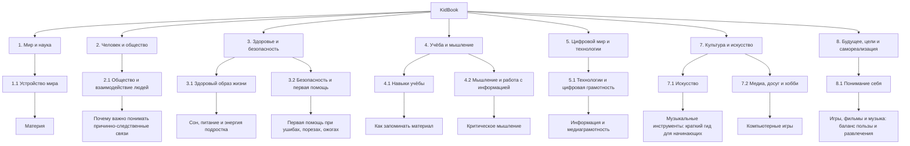

# 📘 Проект "KidBook" — детская энциклопедия

Этот проект объединяет материалы детской энциклопедии, созданной в рамках лабораторной работы по курсу **«Искусственный интеллект»**.

Здесь собраны статьи для школьников о мире вокруг нас, обществе, здоровье, критическом мышлении, технологиях, искусстве, досуге, развлечениях и памяти.

---

## 🌳 Карта разделов

## 🌳 Структура энциклопедии

- **1. Мир и наука**
  - **1.1 Устройство мира**
    - [Материя](1.1_structure_of_the_world/matter/articles/01_matter.md)
    - Земля, природа и климат
  - **1.2 Естественные науки в жизни**
    - Физика вокруг нас в повседневности
    - Нейробиология для подростков
    - Почему наука помогает понимать мир

- **2. Человек и общество**
  - **2.1 Общество и взаимодействие людей**
    - [Твои права и обязанности](2.1_society/index.md)
    - Как и где найти друзей
    - [Почему важно понимать причинно-следственные связи](2.1_society/index.md)
  - **2.2 История, страны и мир вокруг**
    - История России и стран ближнего зарубежья
    - Мировая экономика на пальцах

- **3. Здоровье и безопасность**
  - **3.1 Здоровый образ жизни**
    - [Сон, питание и энергия подростка](3.1_healthy%20lifestyle/Sleep,%20nutrition,%20and%20adolescent%20energy/index.md)
    - Вредные привычки
    - Гигиена и уход за собой
  - **3.2 Безопасность и первая помощь**
    - Как действовать в опасной ситуации
    - [Первая помощь при ушибах, порезах, ожогах](3.1_healthy%20lifestyle/pervaya_pomosch/ushibi_porezy_ozhogi/01_chto_takoe_pervaya_pomoshch.md)

- **4. Учёба и мышление**
  - **4.1 Навыки учёбы**
    - Как учиться эффективно и с удовольствием
    - [Как запоминать материал](how_to_memorize/articles/pamyat.md)
  - **4.2 Мышление и работа с информацией**
    - Как искать и проверять информацию
    - [Критическое мышление](4.2/index.md)

- **5. Цифровой мир и технологии**
  - **5.1 Технологии и цифровая грамотность**
    - Как устроен интернет
    - [Информация и медиаграмотность](5.1_technology_and_digital_literacy/information%20and%20media%20literacy/articles/что_такое_информационная_и_медиаграмотность.md)
    - Как устроена ОС
    - Человек в эпоху алгоритмов: как интернет меняет наше мышление, внимание и личность
  - **5.2 Кибербезопасность и поведение в сети**
    - Как безопасно пользоваться интернетом
    - Основы программирования для начинающих на C++
    - Надёжные пароли и цифровая безопасность

- **6. Быт, деньги и самостоятельность**
  - **6.1 Самостоятельная жизнь и бытовые навыки**
    - Как разумно тратить деньги
    - Простая и безопасная готовка
  - **6.2 Деньги и финансовая грамотность**
    - Как копить на цель
    - Что такое личный бюджет

- **7. Культура и искусство**
  - **7.1 Искусство**
    - Современное техноискусство
    - [Музыкальные инструменты: краткий гид для начинающих](7.1_art/musical_instruments/articles/piano.md)
  - **7.2 Медиа, досуг и хобби**
    - Что можно читать и смотреть для развития вкуса
    - [Компьютерные игры](7.2_leisure/useful_and_interesting_leisure/articles/computer_games_with_benefit.md)
    - [Как выбирать полезный и интересный досуг](7.2_leisure/useful_and_interesting_leisure/articles/leisure_and_why_need.md)
    - [Игры, фильмы и музыка: баланс пользы и развлечения](8.1_entertainment/index.md)

- **8. Будущее, цели и самореализация**
  - **8.1 Понимание себя**
    - Синдром самозванца на новой работе
    - Как найти свои сильные стороны
    - Как справляться со стрессом и неуверенностью
  - **8.2 Будущее и выбор пути**
    - Как выбирать направление и профессию

## 🔗 Дополнительные материалы

- [Корневой README репозитория](../README.md)
- [Инструкция по работе с GitHub](../TUTORIAL/how_to_use_github/README.md)
- [Как писать статьи](../TUTORIAL/how_write_articles/README.md)
