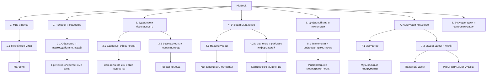

# 📘 KidBook — детская энциклопедия

Добро пожаловать в **KidBook** — детскую энциклопедию для школьников, созданную в рамках лабораторной работы по курсу **«Искусственный интеллект»**.

Проект объединяет статьи о мире вокруг нас, обществе, здоровье, критическом мышлении, технологиях, искусстве, досуге, развлечениях и эффективной учёбе.  
Главная страница показывает **общую архитектуру энциклопедии**, а подробные материалы доступны внутри тематических разделов.

---

## 🌳 Карта проекта

---

## 🗂 Разделы энциклопедии

### 1. Мир и наука
Раздел о строении мира, веществе, свойствах материи и фундаментальных физических явлениях.  
[Перейти к материалам о веществе](1.1_structure_of_the_world/matter/articles/01_matter.md)

### 2. Человек и общество
Раздел о том, как устроено общество, как люди взаимодействуют друг с другом и почему важно понимать причины и последствия событий.  
[Перейти к разделу](2.1_society/index.md)

### 3. Здоровье и безопасность
Раздел о здоровом образе жизни, режиме дня, питании, энергии подростка и базовых правилах первой помощи.  
[Сон, питание и энергия подростка](3.1_healthy%20lifestyle/Sleep,%20nutrition,%20and%20adolescent%20energy/index.md)  
[Первая помощь](3.1_healthy%20lifestyle/pervaya_pomosch/ushibi_porezy_ozhogi/01_chto_takoe_pervaya_pomoshch.md)

### 4. Учёба и мышление
Раздел о том, как лучше учиться, запоминать информацию, проверять факты и развивать критическое мышление.  
[Как запоминать материал](how_to_memorize/articles/pamyat.md)  
[Критическое мышление](4.2/index.md)

### 5. Цифровой мир и технологии
Раздел о медиаграмотности, цифровой безопасности, проверке информации и поведении в современной информационной среде.  
[Информация и медиаграмотность](5.1_technology_and_digital_literacy/information%20and%20media%20literacy/articles/что_такое_информационная_и_медиаграмотность.md)

### 7. Культура и искусство
Раздел об искусстве, музыкальных инструментах, досуге, хобби, играх, фильмах и музыке.  
[Музыкальные инструменты](7.1_art/musical_instruments/articles/piano.md)  
[Полезный и интересный досуг](7.2_leisure/useful_and_interesting_leisure/articles/leisure_and_why_need.md)  
[Игры, фильмы и музыка](8.1_entertainment/index.md)

---

## ⚡ Быстрая навигация

- **1. Мир и наука**
  - **1.1 Устройство мира**
    - **Материя**
      - [Что такое вещество](1.1_structure_of_the_world/matter/articles/01_matter.md)
      - [Атомизм](1.1_structure_of_the_world/matter/articles/02_atomism.md)
      - [Строение атома](1.1_structure_of_the_world/matter/articles/03_atom_structure.md)

- **2. Человек и общество**
  - **2.1 Общество и взаимодействие людей**
    - **Почему важно понимать причинно-следственные связи**
      - [Страница раздела](2.1_society/index.md)
      - [Причинность: фундамент логики](2.1_society/cause_and_effect_relationships/articles/causality_base.md)
      - [Выбор и его плоды](2.1_society/cause_and_effect_relationships/articles/personal_choice.md)
      - [Этическая ответственность](2.1_society/cause_and_effect_relationships/articles/responsibility.md)

- **3. Здоровье и безопасность**
  - **3.1 Здоровый образ жизни**
    - **Сон, питание и энергия подростка**
      - [Страница раздела](3.1_healthy%20lifestyle/Sleep,%20nutrition,%20and%20adolescent%20energy/index.md)
      - [Почему подростки поздно засыпают](3.1_healthy%20lifestyle/Sleep,%20nutrition,%20and%20adolescent%20energy/articles/biology_of_night_owls_teens.md)
      - [Завтрак для мозга](3.1_healthy%20lifestyle/Sleep,%20nutrition,%20and%20adolescent%20energy/articles/breakfast_for_the_brain.md)
  - **3.2 Безопасность и первая помощь**
    - **Первая помощь при ушибах, порезах, ожогах**
      - [Что такое первая помощь](3.1_healthy%20lifestyle/pervaya_pomosch/ushibi_porezy_ozhogi/01_chto_takoe_pervaya_pomoshch.md)
      - [Цели первой помощи](3.1_healthy%20lifestyle/pervaya_pomosch/ushibi_porezy_ozhogi/02_celi_pervoy_pomoshchi.md)
      - [Общие правила и алгоритм](3.1_healthy%20lifestyle/pervaya_pomosch/ushibi_porezy_ozhogi/03_obschie_pravila_algorithm.md)

- **4. Учёба и мышление**
  - **4.1 Навыки учёбы**
    - **Как запоминать материал**
      - [Память](how_to_memorize/articles/pamyat.md)
      - [Внимание](how_to_memorize/articles/vnimanie.md)
      - [Повторение](how_to_memorize/articles/povtorenie.md)
  - **4.2 Мышление и работа с информацией**
    - **Критическое мышление**
      - [Страница раздела](4.2/index.md)
      - [Логические выводы](4.2/critical_thinking/articles/methods_of_logical_inference.md)
      - [Оценка источников](4.2/critical_thinking/articles/source_evaluation.md)
      - [Информационные пузыри](4.2/critical_thinking/articles/information_bubbles.md)

- **5. Цифровой мир и технологии**
  - **5.1 Технологии и цифровая грамотность**
    - **Информация и медиаграмотность**
      - [Что такое информационная и медиаграмотность](5.1_technology_and_digital_literacy/information%20and%20media%20literacy/articles/что_такое_информационная_и_медиаграмотность.md)
      - [Дезинформация и фейки](5.1_technology_and_digital_literacy/information%20and%20media%20literacy/articles/дезинформация_и_фейки.md)
      - [Фактчекинг пошагово](5.1_technology_and_digital_literacy/information%20and%20media%20literacy/articles/фактчекинг_пошагово.md)

- **7. Культура и искусство**
  - **7.1 Искусство**
    - **Музыкальные инструменты**
      - [Фортепиано](7.1_art/musical_instruments/articles/piano.md)
      - [Гитара](7.1_art/musical_instruments/articles/guitar.md)
      - [Скрипка](7.1_art/musical_instruments/articles/violin.md)
  - **7.2 Медиа, досуг и хобби**
    - **Полезный и интересный досуг**
      - [Досуг и зачем он нужен](7.2_leisure/useful_and_interesting_leisure/articles/leisure_and_why_need.md)
      - [Чтение и самообразование](7.2_leisure/useful_and_interesting_leisure/articles/reading_and_self_education.md)
      - [Компьютерные игры с пользой](7.2_leisure/useful_and_interesting_leisure/articles/computer_games_with_benefit.md)
    - **Игры, фильмы и музыка: баланс пользы и развлечения**
      - [Страница раздела](8.1_entertainment/index.md)
      - [История видеоигр](8.1_entertainment/articles/history-of-games.md)
      - [Фильм](8.1_entertainment/articles/movie.md)
      - [Музыка](8.1_entertainment/articles/music.md)

---
